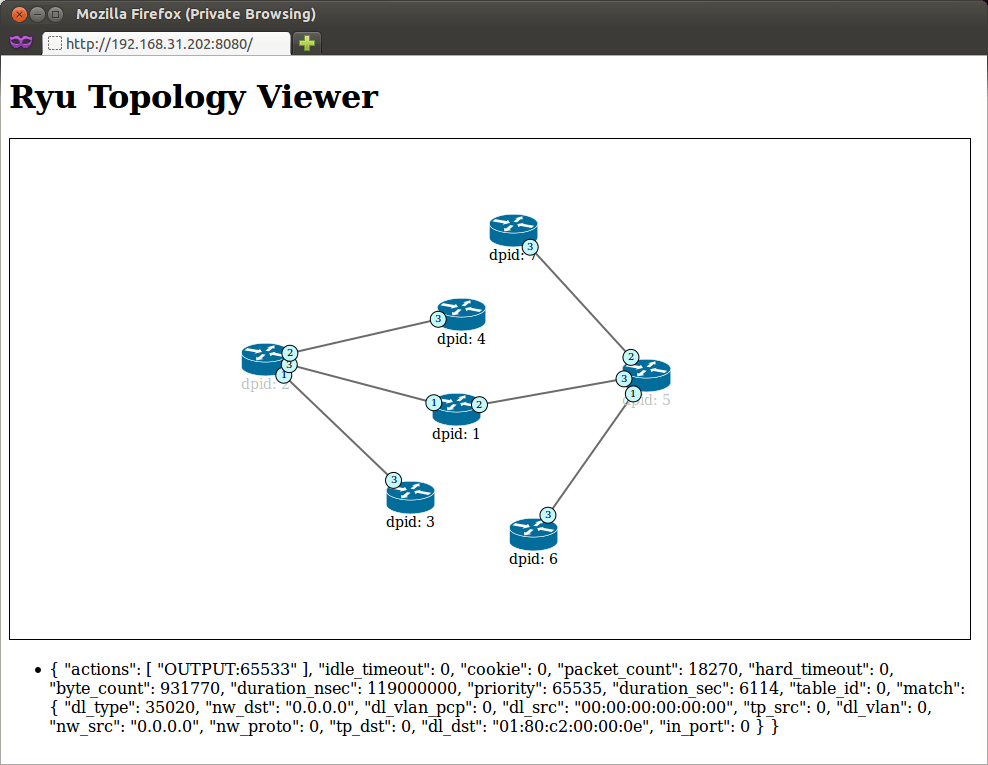

***************
Topology Viewer
***************

ryu.app.gui_topology.gui_topology provides topology visualization.

This depends on following ryu applications.

===================== =================================================
ryu.app.rest_topology Get node and link data.
ryu.app.ws_topology   Being notified change of link up/down.
ryu.app.ofctl_rest    Get flows of datapaths.
===================== =================================================

Usage
=====

Run mininet (or join your real environment)::

    $ sudo mn --controller remote --topo tree,depth=3

Run GUI application::

    $ PYTHONPATH=. ./bin/ryu run --observe-links ryu/app/gui_topology/gui_topology.py

Access http://<ip address of ryu host>:8080 with your web browser.

Screenshot
==========

